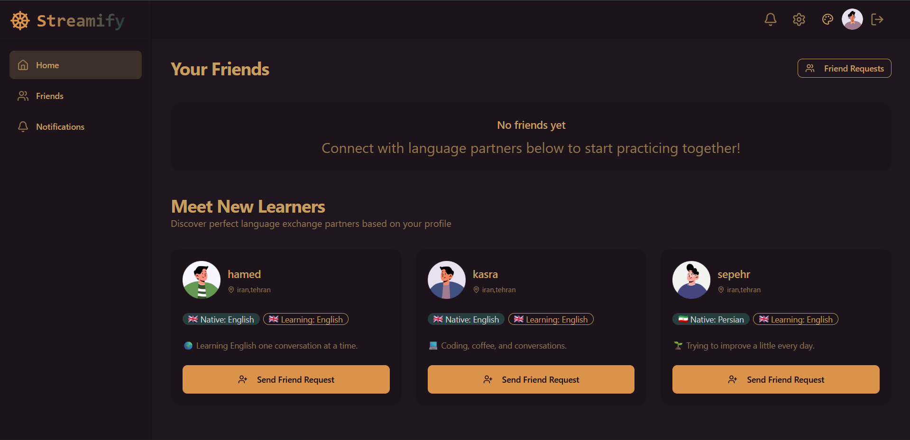
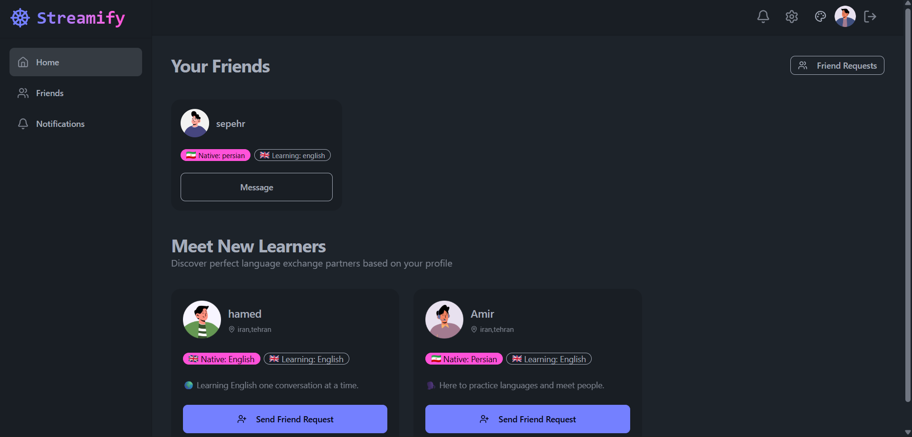
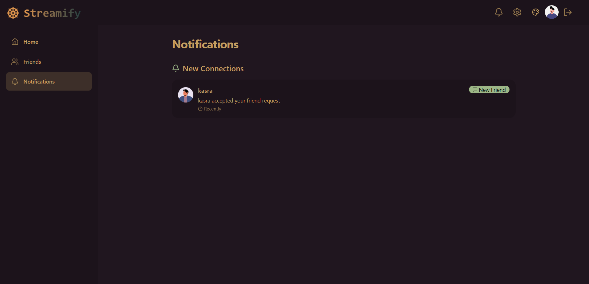
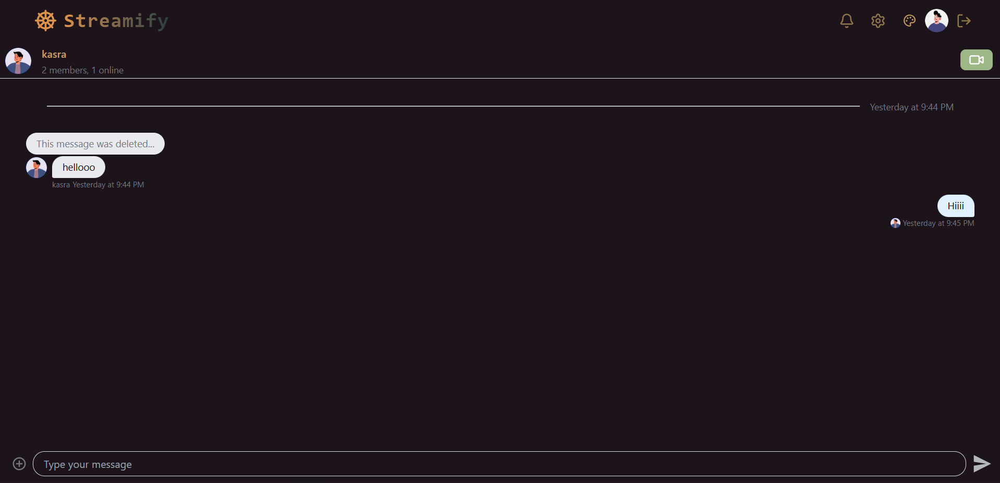
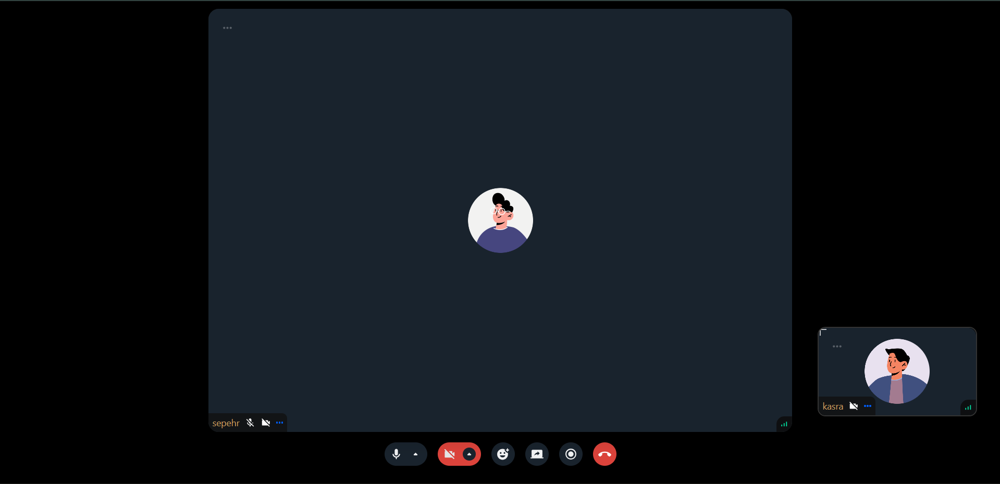
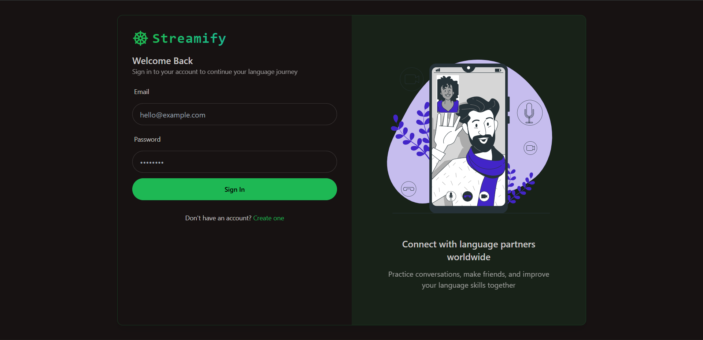

[Uploading README (1).md…]()
<div align="center">

# 🌐 Streamify

### Real-time chat & video calling platform for language exchange partners

Connect with people around the world, practice a new language, and make friends — all in one place.

[](https://react.dev)
[](https://vitejs.dev)
[](https://tailwindcss.com)
[](https://nodejs.org)
[](https://www.mongodb.com)
[](https://getstream.io)

</div>

---

## ✨ Features

- 🔐 **Authentication** — secure signup/login flow with protected routes
- 👥 **Friend system** — send, receive, and accept friend requests; browse recommended language partners based on your profile
- 💬 **Real-time messaging** — instant 1:1 chat powered by Stream Chat, with read receipts, typing indicators, and message history
- 📹 **Video calling** — in-app video calls with a custom Google Meet–style layout: the other participant centered in full view, your own camera floating in a resizable corner window (drag to resize, just like Meet)
- 🌍 **Language matching** — profiles include native & learning languages with flag indicators, so you can find the right practice partner
- 🎨 **32+ live themes** — switch the entire app's look instantly with a built-in theme selector (powered by daisyUI), preference saved across sessions
- 🔔 **Notifications** — see incoming and accepted friend requests in one place
- 📱 **Fully responsive UI** — clean, modern interface built with Tailwind CSS + daisyUI, works on desktop and mobile

---
## Live Demo
https://github.com/user-attachments/assets/3a173005-4ed0-4435-aad1-6fe6eb442e6e

## 📸 Screenshots

<table>
  <tr>
    <td align="center">
      
      <br>
      <b>Homepage</b>
    </td>
    <td align="center">
      
      <br>
      <b>Friends List</b>
    </td>
    <td align="center">
      
      <br>
      <b>Notifications</b>
    </td>
  </tr>

  <tr>
    <td align="center">
      
      <br>
      <b>Chat Page</b>
    </td>
    <td align="center">
      
      <br>
      <b>Video Call</b>
    </td>
    <td align="center">
      
      <br>
      <b>Login Page</b>
    </td>
  </tr>
</table>
---

## 🛠️ Tech Stack

### Frontend
| Technology | Purpose |
|---|---|
| **React** | UI library |
| **Vite** | Dev server & build tool |
| **React Router** | Client-side routing |
| **TanStack Query** | Server state management, caching & data fetching |
| **Zustand** | Lightweight global state (e.g. theme store) |
| **Tailwind CSS + daisyUI** | Styling & prebuilt themeable components |
| **Stream Chat React** | Real-time chat UI & SDK |
| **Stream Video React SDK** | Real-time video calling |
| **Axios** | HTTP client |
| **React Hot Toast** | Toast notifications |
| **Lucide React** | Icon set |

### Backend
| Technology | Purpose |
|---|---|
| **Node.js + Express** | REST API server |
| **MongoDB + Mongoose** | Database & ODM |
| **JWT (httpOnly cookie)** | Authentication & session handling |
| **bcryptjs** | Password hashing |
| **Stream Chat (server SDK)** | User upsert & token generation for chat/video sessions |
| **cors / cookie-parser / dotenv** | Middleware & environment config |

---

## 📁 Project Structure

```
meet-app/
├── frontend/
│   ├── src/
│   │   ├── components/     # Reusable UI components (CallButton, ThemeSelector, ...)
│   │   ├── pages/          # Route-level pages (HomePage, ChatPage, CallPage, ...)
│   │   ├── hooks/          # Custom React hooks (useAuthUser, useLogin, useSignUp, ...)
│   │   ├── store/          # Zustand stores (useThemeStore)
│   │   ├── lib/            # API client & utilities
│   │   └── constants/      # App-wide constants (themes, languages, ...)
│   └── ...
└── backend/
    └── src/
        ├── controllers/    # auth.controller.js, user.controller.js, chat.controller.js
        ├── routes/         # auth.route.js, user.route.js, chat.route.js
        ├── models/         # Users.js, FriendRequest.js
        ├── middleware/     # auth.middleware.js (JWT route protection)
        ├── lib/            # db.js, env.js, stream.js
        └── server.js
```

---

## 🔌 API Endpoints

| Method | Endpoint | Description |
|---|---|---|
| `POST` | `/api/auth/signup` | Register a new user |
| `POST` | `/api/auth/login` | Log in and receive a JWT cookie |
| `POST` | `/api/auth/logout` | Clear the auth cookie |
| `POST` | `/api/auth/onboarding` | Complete profile setup (bio, languages, location) |
| `GET` | `/api/auth/me` | Get the currently authenticated user |
| `GET` | `/api/users` | Get recommended (not-yet-friended) users |
| `GET` | `/api/users/friends` | Get the current user's friend list |
| `POST` | `/api/users/friend-request/:id` | Send a friend request |
| `PUT` | `/api/users/friend-request/:id/accept` | Accept a friend request |
| `GET` | `/api/users/friend-requests` | Get incoming & accepted friend requests |
| `GET` | `/api/users/outgoing-friend-requests` | Get requests you've sent that are still pending |
| `GET` | `/api/chat/token` | Get a Stream token for chat/video sessions |

All routes except `signup`, `login`, and `logout` require authentication via the `jwt` httpOnly cookie.

---

### Prerequisites
- Node.js (v18+ recommended)
- npm or yarn
- A MongoDB instance (local or Atlas)
- A [Stream](https://getstream.io) account (API key & secret for Chat and Video)

### 1. Clone the repository
```bash
git clone https://github.com/<your-username>/meet-app.git
cd meet-app
```

### 2. Setup the backend
```bash
cd backend
npm install
```

Create a `.env` file in `backend/`:
```env
PORT=5000
DB_URL=your_mongodb_connection_string
NODE_ENV=development
CLIENT_URL=http://localhost:5173
JWT_SECRET_KEY=your_jwt_secret
STEAM_API_KEY=your_stream_api_key
STEAM_API_SECRET=your_stream_api_secret
```
> Note: the env variable names above (`STEAM_API_KEY` / `STEAM_API_SECRET`) match what's used in the current codebase — yes, missing an "R". Keep it consistent, or rename it everywhere (`lib/env.js` and `lib/stream.js`) if you'd rather fix the typo.

```bash
npm run dev
```

### 3. Setup the frontend
```bash
cd ../frontend
npm install
```

Create a `.env` file in `frontend/`:
```env
VITE_STREAM_API_KEY=your_stream_api_key
```

```bash
npm run dev
```

The app should now be running at `http://localhost:5173`.

---

## 🎥 Video Call Layout

The call screen uses a custom layout built on top of the Stream Video SDK:
- The **remote participant** fills the main centered frame
- Your **own camera** appears as a small floating window in the bottom-right corner
- Drag the corner handle on your own video to resize it, live — no page reload needed

---

## 📄 License

This project is open source and available under the [MIT License](LICENSE).

---

<div align="center">
Made with ❤️ using React & Stream
</div>
